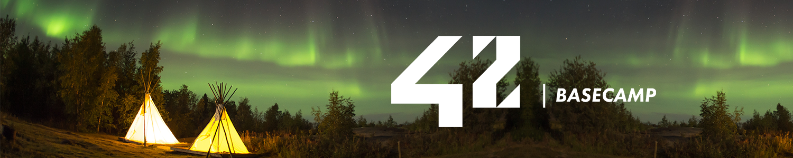

# _Basecamp_ 42SP 🏕️

  

This repository contains coding developed at [42SP](https://www.42sp.org.br/) Basecamp, from 31/may/21 to 19/jun/21.

## 👨🏻‍💻 About 42

42 is a global education initiative that proposes a new way of learning technology: no teachers, no classrooms, students learning from their fellow students (peer to peer learning), with a methodology that develops both computing and life skills.

## 🚀 Skills developed at 42Basecamp

### 🔩 HARD-SKILLS

    # C Language
    	The primary language learned at the 42's Piscine is C: dealing with variables,
    	pointers, memory allocation, macros, as well as creating functions and programs,
    	including the use and creation of libraries and Makefiles.

    # Shell
    	The first two days of the bootcamp are dedicated to learning basic to intermediate
    	shell commands to seamlessly navigate through the terminal.

    # Git
    	All projects are submitted via a remote git repository, which demands students to
    	be at ease with such a system.

### 💖 SOFT-SKILLS

    # Self-learning and proactiveness
    	At 42, self-learning is at the core of its peer to peer learning methodology. There
    	are no teachers whatsoever; the learning process is based on googling, enquiring
    	your classmates, and empirical knowledge, each student learning at their own pace.

    # Teamwork
    	On weekends, a 48h team project called "Rush" is proposed: a 3-member group randomly
    	chosen by the school's system must collaboratively develop a fully running application.
    	The major challenge here is to equalize the different knowledge levels while finding a
    	common work methodology that allows all team members to contribute to the project.

    # Time management and resiliency
    	This basecamp was completely online on Discord, so everyone were free to work whenever
    	they want, which demands excellent time management skills and resiliency for not
    	"drowning" amid the massive load of work demanded by the non-stop 19-day program.

## 📜 CURRICULUM

The table below presents the 42Basecamp curriculum in chronological order in which it was completed by me - order of completed subjects and corresponding attained level may vary among students.

| SUBJECT               | LANGUAGE |                  STATUS |
| :-------------------- | :------: | ----------------------: |
| Eu aceito             |   N/A    | 100% :heavy_check_mark: |
| [Shell 00](./shell00) |  Shell   |  50% :heavy_check_mark: |
| Exam 00               |    C     |                  4% :x: |
| [Rush 00](./rush00)   |    C     |                  0% :x: |
| [Shell 01](./shell01) |  Shell   |  85% :heavy_check_mark: |
| Exam 01               |    C     |                  4% :x: |
| Rush 01               |    C     |                  0% :x: |
| [C 00](./c00)         |    C     |  85% :heavy_check_mark: |
| [C 01](./c01)         |    C     |  85% :heavy_check_mark: |
| [C 02](./c02)         |    C     |  75% :heavy_check_mark: |
| C 03                  |    C     |                  0% :x: |
| C 04                  |    C     |                  0% :x: |
| C 06                  |    C     |                  0% :x: |
| C 05                  |    C     |                  0% :x: |
| C 07                  |    C     |                  0% :x: |
| C 08                  |    C     |                  0% :x: |
| C 09                  |    C     |                  0% :x: |
| C 10                  |    C     |                  0% :x: |
| C 11                  |    C     |                  0% :x: |
| C 12                  |    C     |                  0% :x: |
| C 13                  |    C     |                  0% :x: |
| Final Exam            |    C     |                  8% :x: |

## 🤝 Show your support

Give a ⭐️ if this project helped you or if just you like it!

---

Made with ❤ by [Guilherme Teixeira](https://github.com/guitexa)
